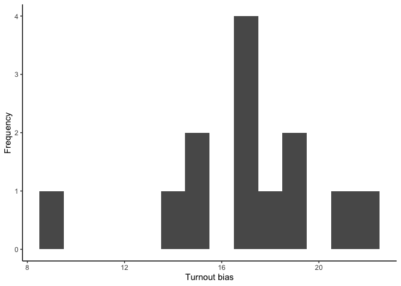
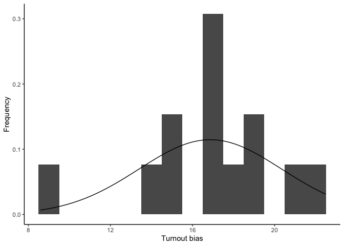

```r
library(tidyverse)
```

```
## ── Attaching core tidyverse packages ──────────────────────── tidyverse 2.0.0 ──
## ✔ dplyr     1.1.3     ✔ readr     2.1.4
## ✔ forcats   1.0.0     ✔ stringr   1.5.0
## ✔ ggplot2   3.4.3     ✔ tibble    3.2.1
## ✔ lubridate 1.9.2     ✔ tidyr     1.3.0
## ✔ purrr     1.0.2     
## ── Conflicts ────────────────────────────────────────── tidyverse_conflicts() ──
## ✖ dplyr::filter() masks stats::filter()
## ✖ dplyr::lag()    masks stats::lag()
## ℹ Use the conflicted package (<http://conflicted.r-lib.org/>) to force all conflicts to become errors
```

```r
library(dplyr)
library(ggplot2)

anes <- read_csv("ANES.csv")
```

```
## Rows: 13 Columns: 9
## ── Column specification ────────────────────────────────────────────────────────
## Delimiter: ","
## dbl (9): year, presidential, midterm, ANES_turnout, votes, VEP, VAP, felons,...
## 
## ℹ Use `spec()` to retrieve the full column specification for this data.
## ℹ Specify the column types or set `show_col_types = FALSE` to quiet this message.
```

```r
anes
```

```
## # A tibble: 13 × 9
##     year presidential midterm ANES_turnout  votes    VEP    VAP felons
##    <dbl>        <dbl>   <dbl>        <dbl>  <dbl>  <dbl>  <dbl>  <dbl>
##  1  1980            1       0           71  86515 159635 164445    802
##  2  1982            0       1           60  67616 160467 166028    960
##  3  1984            1       0           74  92653 167702 173995   1165
##  4  1986            0       1           53  64991 170396 177922   1367
##  5  1988            1       0           70  91595 173579 181955   1594
##  6  1990            0       1           47  67859 176629 186159   1901
##  7  1992            1       0           75 104405 179656 190778   2183
##  8  1994            0       1           56  75106 182623 195258   2441
##  9  1996            1       0           73  96263 186347 200016   2586
## 10  1998            0       1           52  72537 190420 205313   2920
## 11  2000            1       0           73 105375 194331 210623   3083
## 12  2002            0       1           62  78382 198382 215462   3168
## 13  2004            1       0           77 122295 203483 220336   3158
## # ℹ 1 more variable: noncitizens <dbl>
```

## Part 2

1.  Creating VEP turnout


```r
anes$VEP_turnout <- anes$votes/anes$VEP * 100
```

2.  


```r
head(anes)
```

```
## # A tibble: 6 × 10
##    year presidential midterm ANES_turnout votes    VEP    VAP felons noncitizens
##   <dbl>        <dbl>   <dbl>        <dbl> <dbl>  <dbl>  <dbl>  <dbl>       <dbl>
## 1  1980            1       0           71 86515 159635 164445    802        5756
## 2  1982            0       1           60 67616 160467 166028    960        6641
## 3  1984            1       0           74 92653 167702 173995   1165        7482
## 4  1986            0       1           53 64991 170396 177922   1367        8362
## 5  1988            1       0           70 91595 173579 181955   1594        9280
## 6  1990            0       1           47 67859 176629 186159   1901       10239
## # ℹ 1 more variable: VEP_turnout <dbl>
```

The first value of VEP_turnout is 54.2, the unit of measurement is percent, so the interpretation is that 54.2 % of the eligible voters actually cast a vote. This is to be expected from a voting eligible population of 159635 people and 86515 votes.

3.  


```r
anes$VAP_turnout <- anes$votes/anes$VAP * 100
```

4.  


```r
head(anes)
```

```
## # A tibble: 6 × 11
##    year presidential midterm ANES_turnout votes    VEP    VAP felons noncitizens
##   <dbl>        <dbl>   <dbl>        <dbl> <dbl>  <dbl>  <dbl>  <dbl>       <dbl>
## 1  1980            1       0           71 86515 159635 164445    802        5756
## 2  1982            0       1           60 67616 160467 166028    960        6641
## 3  1984            1       0           74 92653 167702 173995   1165        7482
## 4  1986            0       1           53 64991 170396 177922   1367        8362
## 5  1988            1       0           70 91595 173579 181955   1594        9280
## 6  1990            0       1           47 67859 176629 186159   1901       10239
## # ℹ 2 more variables: VEP_turnout <dbl>, VAP_turnout <dbl>
```

The first value of VAP_turnout is 52.6%, meaning that 52.6% of the voting age population voted. This is to be expected from a voting age population of 164445 people and 86515 votes.

5.  

The VAP_turnout is lower than VEP_turnout which makes sense since the denominator will always be larger than or equal to that of the VEP_turnout, since the voting eligible population is a subset of the voting age population.

6.  


```r
mean_VEP_turnout <- mean(anes$VEP_turnout)
mean_VEP_turnout
```

```
## [1] 47.97976
```

The mean of VEP turnout is 48 percent, meaning that across the 13 federal elections, 48 percent of the voting eligible population voted.

7.  


```r
mean_ANES_turnout <- mean(anes$ANES_turnout)
mean_ANES_turnout
```

```
## [1] 64.84615
```

The mean ANES turnout across the 13 federal elections was 64.8 percent, meaning that 64.8 percent of ANES respondents reported voting in the election.

8.  

The ANES reported voter turnout is much higher than the actual VEP voter turnout (about 18 percentage points), which suggests that people in the ANES questionnaire are lying, saying that they voted when they actually didn't. It could also reflect some selection into the ANES data, meaning that people who are more likely to take the questionnaire are also more likely to be politically active and vote.

## Part 3

1.  


```r
anes$turnout_bias <- anes$ANES_turnout - anes$VEP_turnout
```

2.  


```r
head(anes)
```

```
## # A tibble: 6 × 12
##    year presidential midterm ANES_turnout votes    VEP    VAP felons noncitizens
##   <dbl>        <dbl>   <dbl>        <dbl> <dbl>  <dbl>  <dbl>  <dbl>       <dbl>
## 1  1980            1       0           71 86515 159635 164445    802        5756
## 2  1982            0       1           60 67616 160467 166028    960        6641
## 3  1984            1       0           74 92653 167702 173995   1165        7482
## 4  1986            0       1           53 64991 170396 177922   1367        8362
## 5  1988            1       0           70 91595 173579 181955   1594        9280
## 6  1990            0       1           47 67859 176629 186159   1901       10239
## # ℹ 3 more variables: VEP_turnout <dbl>, VAP_turnout <dbl>, turnout_bias <dbl>
```

The turnout bias is the difference between the VEP turnout and the ANES turnout, and thus does take on the expected positive values - indicating that ANES turnout is higher than VEP turnout. The unit of measurement is percentage points.

3.  

    p \<- ggplot(data = level_k_summary,

    mapping = aes(x = levelk,

    fill = as.factor(elite)))

    p + geom_bar(stat = "identity",

    position = "dodge",

    aes(y = pct, group = elite)) +

    scale_fill_discrete(

    guide = guide_legend(title = "Elite"),

    labels = c("Elite", "Undergrad")

    ) +

    theme_classic() +

    xlab("Level-K") +

    ylab("Proportion")


```r
library(ggplot2)

p <- ggplot(data = anes)
p <- p + geom_histogram(mapping = aes(x = turnout_bias ), binwidth=1)
p <- p + theme_classic() + xlab("Turnout bias") + ylab("Frequency")         
p
```

<!-- -->

```r
p_d <- ggplot(data = anes)
p_d <- p_d + geom_histogram(mapping = aes(x = turnout_bias, y=..density.. ), binwidth=1)
p_d <- p_d + theme_classic() + xlab("Turnout bias") + ylab("Frequency")         
p_d <- p_d + stat_function(fun = dnorm, args = list(mean = mean(anes$turnout_bias), sd = sd(anes$turnout_bias)))
p_d
```

```
## Warning: The dot-dot notation (`..density..`) was deprecated in ggplot2 3.4.0.
## ℹ Please use `after_stat(density)` instead.
## This warning is displayed once every 8 hours.
## Call `lifecycle::last_lifecycle_warnings()` to see where this warning was
## generated.
```

<!-- -->

All the values are positive and the variable does look somewhat normally distributed, centered around the mean of 16 with quite similar lengthed tails.

4.  


```r
anes %>%
  group_by(presidential) %>%
  summarise(mean_ANES_turnout = mean(ANES_turnout),
            mean_VEP_turnout  = mean(VEP_turnout),
            mean_turnoutbias  = mean(turnout_bias)
            )
```

```
## # A tibble: 2 × 4
##   presidential mean_ANES_turnout mean_VEP_turnout mean_turnoutbias
##          <dbl>             <dbl>            <dbl>            <dbl>
## 1            0              55               39.6             15.4
## 2            1              73.3             55.2             18.1
```

On average, the ANES turnout was 55%, meaning that 55% of the ANES respondents reported to have voted. On average, 39.6% of the eligible voting population actually voted in the midterm elections. The turnoutbias is 15.4 percentage points, meaning that the average ANES turnout was 15.4 percentage points higher than the average VEP turnout.

On average, the ANES turnout was 73.3%, meaning that 73.3% of the ANES respondents reported to have voted in the presidential elections. On average, 55.2% of the eligible voting population actually voted in the midterm elections. The turnoutbias is 18.1 percentage points, meaning that the average ANES turnout was 18.1 percentage points higher than the average VEP turnout.

The turnout is higher for presidential elections than for midterms (18 percentage points higher for the ANES turnout and 15 percentage points higher for VEP turnout). The turnout-bias also increases in absolute terms, meaning that the gap between the ANES reported turnout rate and the VEP turnout rate is larger for presidential elections than for midterm elections. This could reflect that people feel more social pressure to say that they voted in a presidential election than in midterm elections.

In relative terms, the turnout bias actually decreases.
