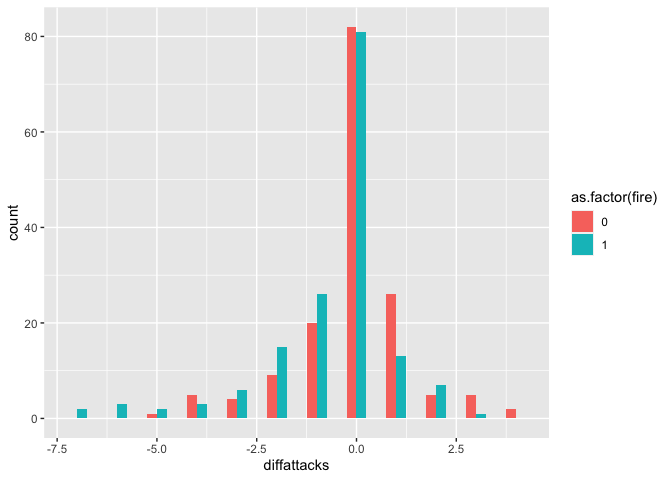

## B1 Homework

#### Indiscriminate Violence and Insurgency


```
## # A tibble: 6 × 6
##   village      groznyy  fire deaths preattack postattack
##   <chr>          <dbl> <dbl>  <dbl>     <dbl>      <dbl>
## 1 Elistanzhi         0     0     NA         4          3
## 2 Malye Shuani       0     1      0         0          1
## 3 Belgatoy           0     1     34         1          0
## 4 Oktya'brskoe       0     0     NA         0          0
## 5 Chiri-Yurt         0     0     NA         4          5
## 6 Gansolchu          0     1      0         0          0
```

```
## [1] 318   6
```

**Question 1**


```r
    chechen %>%
        count(fire)
```

```
## # A tibble: 2 × 2
##    fire     n
##   <dbl> <int>
## 1     0   159
## 2     1   159
```

159 villages in the data were attacked by Russians and an equivalent 159 villages were not attacked by Russians.

**Question 2**


```r
chechen %>%
  filter(fire == 1) %>%
  group_by(groznyy) %>%
  summarise(
            meandeaths = mean(deaths, na.rm = TRUE),
            mediandeaths = median(deaths, na.rm = TRUE),
            n = n()
            )
```

```
## # A tibble: 2 × 4
##   groznyy meandeaths mediandeaths     n
##     <dbl>      <dbl>        <dbl> <int>
## 1       0       1.57            0   152
## 2       1       3.71            3     7
```

When only looking at the villages where there were Russian attacks, it is apparent that the villages in Groznyy experienced a greater number of deaths compared to the villages outside of Groznyy, bot when looking at the mean ( a difference of 2.2 deaths on average) and the median (a difference of 3 deaths). It is important to note, that there were only 7 villages in Groznyy exposed to Russian attacks compared to the 152 outside of Groznyy.

**Question 3**


```r
chechen %>%
  group_by(fire) %>%
  summarise(
            meanpostattacks = mean(postattack, na.rm = TRUE),
            postattack_q25 = quantile(x = postattack, probs = 0.25, na.rm = T),
            postattack_q50 = median(postattack, na.rm = TRUE),
            postattack_q75 = quantile(x = postattack, probs = 0.75, na.rm = T),
            n = n()
            )
```

```
## # A tibble: 2 × 6
##    fire meanpostattacks postattack_q25 postattack_q50 postattack_q75     n
##   <dbl>           <dbl>          <dbl>          <dbl>          <dbl> <int>
## 1     0            2.05              0              0              2   159
## 2     1            1.50              0              0              1   159
```

The average number of insurgent attacks after Russian fire for villages hit by artillery fire is 1.5 while the corresponding number is 2.05 for the villages not hit.

The first and second quartile are identical for villages hit and villages not hit, while the 3rd quartile is one death higher for the villages that were not hit by Russian fire. This suggests that the villages most severely affected, that were not hit, have higher numbers of deaths than the most severely hit villages, that were not affected by Russian artillery fire. That might also be what is reflected in the difference in means between the two groups.

This would suggest that the fires dampened the insurgent attacks, but since we have not compared to the number of attacks before fire, we cannot say anything causal about the descriptive statistics. It might just be, that the villages not hit by Russian fire experience more attacks on average than the villages hit. The table above says nothing about the change in insurgent attacks. I would not conclude that indiscriminate violence reduces insurgent attacks yet.

**Question 4**


```r
chechen %>%
  group_by(fire) %>%
  summarise(
            meanpreattacks = mean(preattack, na.rm = TRUE),
            preattack_q25 = quantile(x = preattack, probs = 0.25, na.rm = T),
            preattack_q50 = median(preattack, na.rm = TRUE),
            preattack_q75 = quantile(x = preattack, probs = 0.75, na.rm = T),
            n = n()
            )
```

```
## # A tibble: 2 × 6
##    fire meanpreattacks preattack_q25 preattack_q50 preattack_q75     n
##   <dbl>          <dbl>         <dbl>         <dbl>         <dbl> <int>
## 1     0           2.15             0             0             3   159
## 2     1           2.11             0             0             2   159
```

The average number of attacks before Russian fire was almost identical for villages hit by Russian fire and for villages not hit. This suggests that, as far as frequency of insurgent attacks, the two groups were similar before Russian artillery fire. Lyall (2009) states that the Russian artillery strikes are uncorrelated with key spatial and demographic characteristics, making it a sound instrument. If we believe that the Russian artillery fires were carried out randomly and that the villages experiencing Russian fire are comparable to the villages that didn't, we are able to draw causal conclusions. The drop in insurgent attacks in the villages affected by Russian artillery fire is, on average, notably larger than the drop in villages not affected.

**Question 5**

Among the villages shelled by Russians, the number of insurgent attacks did not increase after the artillery attack. In fact, the number of insurgent attacks decreased on average. When comparing to the average decrease in attacks in non-shelled villages, the decrease in the shelled villages is substantial. When looking at the distribution of the differences in attacks, we see that the difference in means is mainly driven by a few villages experiencing a vast drop in attacks after Russian fire, as well a generally more skewed distribution compared to the villages not shelled.


```r
chechen %>%
  mutate(diffattacks = postattack - preattack) %>%
  group_by(fire) %>%
  summarise(meandiffattacks = mean(diffattacks, na.rm = TRUE),
            mediandiffattacks = median(diffattacks, na.rm = TRUE)
            )
```

```
## # A tibble: 2 × 3
##    fire meandiffattacks mediandiffattacks
##   <dbl>           <dbl>             <dbl>
## 1     0          -0.101                 0
## 2     1          -0.616                 0
```


```r
chechen_new <- chechen %>%
  mutate(diffattacks = postattack - preattack) 

head(chechen_new)
```

```
## # A tibble: 6 × 7
##   village      groznyy  fire deaths preattack postattack diffattacks
##   <chr>          <dbl> <dbl>  <dbl>     <dbl>      <dbl>       <dbl>
## 1 Elistanzhi         0     0     NA         4          3          -1
## 2 Malye Shuani       0     1      0         0          1           1
## 3 Belgatoy           0     1     34         1          0          -1
## 4 Oktya'brskoe       0     0     NA         0          0           0
## 5 Chiri-Yurt         0     0     NA         4          5           1
## 6 Gansolchu          0     1      0         0          0           0
```

```r
hist2 <- ggplot(
  data=chechen_new, 
  mapping = aes(
    x = diffattacks,
    group = as.factor(fire),
    fill = as.factor(fire)
    ) 
  )

hist2 + geom_histogram(
  position = "dodge",
  binwidth = 0.5
  )
```

<!-- -->

**Question 6**

The mean difference in the `difattacks` variable between villages shelled and villages not shelled is 0.52 attacks, meaning that there were, on average .52 fewer insurgent attacks in the villages shelled than the villages not shelled after the Russian fire. The difference-in-differences estimator has shown that the change in insurgent attacks in shelled villages is greater in magnitude than the change in insurgent attacks in villages not shelved. Accepting the assumption that villages shelled and not shelled do not vary systematically and that the Russian artillery fire was carried out randomly, i.e. not correlated with any characteristics specific to the villages, this analysis supports the claim that indiscriminate violence reduces insurgency attacks.

The validity of this analysis is improved compared to the previous questions since this analysis takes the change into account and not just the post Russian fire data. Using information on insurgency attacks before the Russian fire allows us to compute whether the Russian fires actually made a difference to the number of insurgency attacks or not. We needed pre-treatment data, so to speak, to evaluate any type of effect before even beginning to talk about causality.


```r
mean(chechen_new$diffattacks[chechen_new$fire == 1])-mean(chechen_new$diffattacks[chechen_new$fire == 0])
```

```
## [1] -0.5157233
```


