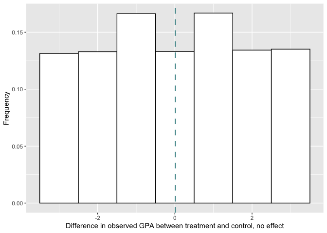
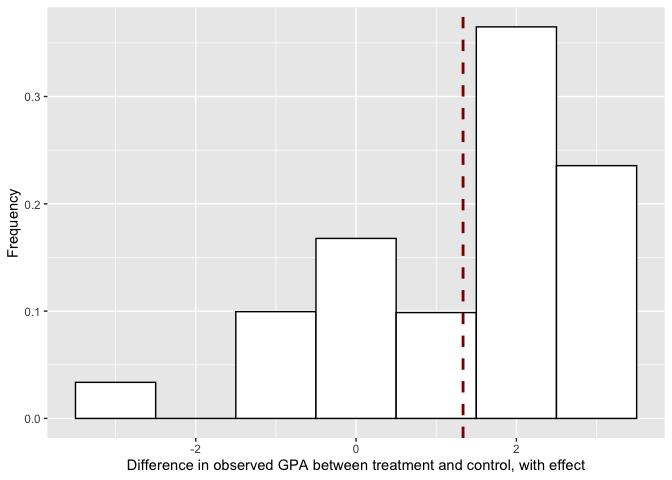

## B4 HOMEWORK

#### 1. Running the code 


```r
set.seed(36850)

sample_space_coin <- c("H", "T")
event_probs_coin <- c(0.5, 0.5)


coin_flip <- function(){
  sample(
    size = 1,
    x = sample_space_coin,
    prob = event_probs_coin,
    replace = TRUE
    )
  }


coin_flip()
```

```
## [1] "H"
```

Output from running coin_flip() 10 times:
\> coin_flip()
[1] "T"
\> coin_flip()
[1] "H"
\> coin_flip()
[1] "T"
\> coin_flip()
[1] "H"
\> coin_flip()
[1] "T"
\> coin_flip()
[1] "T"
\> coin_flip()
[1] "T"
\> coin_flip()
[1] "T"
\> coin_flip()
[1] "H"
\> coin_flip()
[1] "T"

#### 2. Turning coin_flip() into a numeric binary variable


```r
set.seed(36850)
flip1 <- coin_flip()
flip2 <- coin_flip()
flip3 <- coin_flip()
flip4 <- coin_flip()

# Example flips, they will always be the same because I set a random seed.
flip1 # H
```

```
## [1] "H"
```

```r
flip2 # T
```

```
## [1] "T"
```

```r
flip3 # T
```

```
## [1] "T"
```

```r
flip4 # H
```

```
## [1] "H"
```

```r
# Function that acts like a random variable.
# returns 1 if flip == "H" and 0 otherwise.
X_coin <- function(flip){
 ifelse(flip=="H",1,0)
}

# The code below should return a 1 for flip1 and flip4 and 0 for flip2 and flip3
X_coin(flip1)
```

```
## [1] 1
```

```r
X_coin(flip2)
```

```
## [1] 0
```

```r
X_coin(flip3)
```

```
## [1] 0
```

```r
X_coin(flip4)
```

```
## [1] 1
```

#### 3. Describing X_coin

1.  Given how we've generated coin_flip, which is the data generating process that X_coin is based on, there is a 50% probability of getting a 1 (heads).
2.  There is a 50% probability of getting a 0 (tails).
3.  The expectation of X_coin is: E[X_coin]=0.5\*1+0.5\*0=0.5
4.  The variance of X_coin is: Var[X_coin] = E[X_coin\^2]-E[X_coin]\^2 = 0.5\*1\^2+0.5\*0\^2-0.5\^2=0,25. This makes sense since we get 1 half the time and 0 half the time.

#### 4. Creating a biased coinflip


```r
set.seed(36850)
event_probs_biased_coin <- c(0.7, 0.3)

biased_coin_flip <- function(){
  sample(
    size = 1,
    x = sample_space_coin,
    prob = event_probs_biased_coin,
    replace = TRUE
  )
}
```

#### 5. Creating a new biased coin flip binary numeric variable


```r
set.seed(36850)
flip1 <- biased_coin_flip()
flip2 <- biased_coin_flip()
flip3 <- biased_coin_flip()
flip4 <- biased_coin_flip()

# Example flips, they will always be the same because I set a random seed.
flip1 
```

```
## [1] "H"
```

```r
flip2 
```

```
## [1] "H"
```

```r
flip3 
```

```
## [1] "H"
```

```r
flip4 
```

```
## [1] "T"
```

```r
X_biased_coin <- function(flip){
  ifelse(flip == "H", 1, 0) # ifelse is helpful
}

# Use this to test out your code.
X_biased_coin(flip1)
```

```
## [1] 1
```

```r
X_biased_coin(flip2)
```

```
## [1] 1
```

```r
X_biased_coin(flip3)
```

```
## [1] 1
```

```r
X_biased_coin(flip4)
```

```
## [1] 0
```

a\. The probability of getting a 1 is 0.7.

b\. The probability of getting a 0 is 0.3.

#### 5. Deriving statistical moments of the biased random variable

a\. The expectation of X_coin is derived in 3 and is 0.5

b\. The expectation of X_biased_coin is: E[X_biased_coin] = 0.7\*1+0.3\*0 = 0.7

c\. The expectation of the sum of the two variables: E[X_coin + X_biased_coin]=E[X_coin]+E[X_biased_coin]=0.5+0.7=1.2

#### 6. Using simulation to calculate the same three elements


```r
set.seed(36850)

nsims <- 100000

# vectors where you can store the results of simulation for a, b, and c
X_coin_sims <- vector(mode = 'numeric', length = nsims)
X_biased_coin_sims <- vector(mode = 'numeric', length = nsims)
unbiased_plus_biased_coin_sims <- vector(mode = 'numeric', length = nsims)

# Code for part a: simulate X_coin
for(i in 1:nsims){
  sim_flip_i <- coin_flip()
  X_coin_sims[i] <- X_coin(sim_flip_i)
  
  sim__biasedflip_i <- biased_coin_flip()
  X_biased_coin_sims[i] <- X_biased_coin(sim__biasedflip_i)
  
  unbiased_plus_biased_coin_sims[i] <- X_coin(sim_flip_i) + X_biased_coin(sim__biasedflip_i)
}

# use head to see the first part of the result of the simulations
head(X_coin_sims)
```

```
## [1] 1 0 0 0 0 1
```

```r
# calculate the expectation of the simulations using mean()
mean(X_coin_sims)
```

```
## [1] 0.50161
```

```r
# Now do the same thing for parts b and c
# b
head(X_biased_coin_sims)
```

```
## [1] 1 0 0 1 1 1
```

```r
mean(X_biased_coin_sims)
```

```
## [1] 0.70098
```

```r
# c
head(unbiased_plus_biased_coin_sims)
```

```
## [1] 2 0 0 1 1 2
```

```r
mean(unbiased_plus_biased_coin_sims)
```

```
## [1] 1.20259
```

#### 7. Effect of Getana on students' GPA


```r
student_index <- 1:6
Y1 <- c(4, 4, 3, 2, 1, 1)
Y0 <- Y1
##################
set.seed(36850)

nsims <- 100000

gpa_treat_minus_control_sims <- vector(mode = "numeric",
                                       length = nsims)

for(i in 1:nsims){
  treated_subj_index <- sample(student_index, size = 1)
  control_subj_index <- sample(student_index[-treated_subj_index], size = 1)
  
  observed_treatement_GPA <- Y1[treated_subj_index]
  observed_control_GPA <-   Y0[control_subj_index]

  gpa_treat_minus_control_sims[i] <- observed_treatement_GPA - observed_control_GPA 
}

# Calculate the average of gpa_treat_minus_control_sims
mean(gpa_treat_minus_control_sims)
```

```
## [1] 0.0145
```

```r
mean(Y1 - Y0)
```

```
## [1] 0
```

The effect is close to zero but not quite (0.015) when using the simulation and is a clean 0 when comparing means. This difference is caused due to the added element of randomness from the simulations. If we increased the number of simulations, the average difference in observed treatment and control GPA would move towards 0.


```r
# creating dataframe
df <- data.frame(
  gpa_effect_sims = gpa_treat_minus_control_sims
)


library(ggplot2)
hist <- ggplot(df, aes(x = gpa_treat_minus_control_sims))
hist <- hist + geom_histogram(aes(y=..density..), color="black", fill="white", binwidth=1)
hist <- hist + xlab("Difference in observed GPA between treatment and control, no effect") + ylab("Frequency")  
hist <- hist + geom_vline(aes(xintercept=mean(gpa_treat_minus_control_sims)), color="cadetblue", linetype="dashed", size=1)
```

```
## Warning: Using `size` aesthetic for lines was deprecated in ggplot2 3.4.0.
## ℹ Please use `linewidth` instead.
## This warning is displayed once every 8 hours.
## Call `lifecycle::last_lifecycle_warnings()` to see where this warning was
## generated.
```

```r
hist
```

```
## Warning: The dot-dot notation (`..density..`) was deprecated in ggplot2 3.4.0.
## ℹ Please use `after_stat(density)` instead.
## This warning is displayed once every 8 hours.
## Call `lifecycle::last_lifecycle_warnings()` to see where this warning was
## generated.
```

<!-- -->

#### 8. Repeating with new outcomes where there seems to be a treatment effect


```r
student_index <- 1:6
Y1 <- c(4, 4, 3, 3, 4, 1)
Y0 <- c(2, 1, 4, 2, 1, 1)
##################
set.seed(36850)

nsims <- 100000

gpa_treat_minus_control_sims <- vector(mode = "numeric",
                                       length = nsims)

for(i in 1:nsims){
  treated_subj_index <- sample(student_index, size = 1)
  control_subj_index <- sample(student_index[-treated_subj_index], size = 1)
  
  observed_treatement_GPA <- Y1[treated_subj_index]
  observed_control_GPA <-   Y0[control_subj_index]

  gpa_treat_minus_control_sims[i] <- observed_treatement_GPA - observed_control_GPA 
}

# Calculate the average of gpa_treat_minus_control_sims
mean(gpa_treat_minus_control_sims)
```

```
## [1] 1.33482
```

```r
mean(Y1 - Y0)
```

```
## [1] 1.333333
```

There is on average a 1.33 improvement in testscores for the treatment group.


```r
# creating dataframe
df <- data.frame(
  gpa_effect_sims = gpa_treat_minus_control_sims
)


library(ggplot2)
hist <- ggplot(df, aes(x = gpa_treat_minus_control_sims))
hist <- hist + geom_histogram(aes(y=..density..), color="black", fill="white", binwidth=1)
hist <- hist + xlab("Difference in observed GPA between treatment and control, with effect") + ylab("Frequency")  
hist <- hist + geom_vline(aes(xintercept=mean(gpa_treat_minus_control_sims)), color="darkred", linetype="dashed", size=1)
hist
```

<!-- -->
